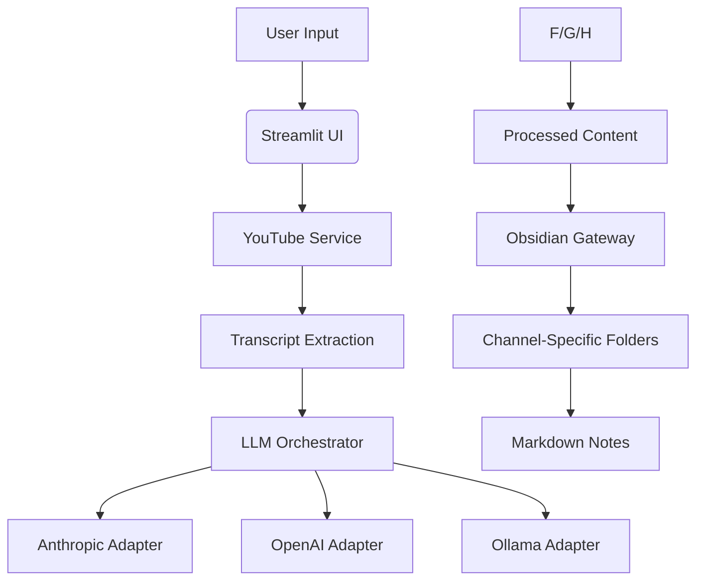

# PostNotes Technical Summary

## Core Functionality
- YouTube video processing pipeline (URL → transcript → LLM processing → Obsidian note)
- Multi-LLM provider support via adapter pattern (Anthropic, OpenAI, Ollama)
- Configurable through JSON settings and UI

## Architecture Overview

## Key Components
1. **YouTubeService**
   - Video ID extraction
   - Transcript fetching
   - Channel metadata retrieval

2. **LLMOrchestrator**
   - Adapter pattern implementation
   - System instruction templating
   - Response formatting

3. **ObsidianGateway**
   - Vault path management
   - Folder creation/validation
   - Markdown file generation

## Configuration Management
- JSON-based configuration
- Encrypted credential storage
- Fallback to default settings

## Implementation Status
- Active Development Phase
- Current Focus: Anthropic integration
- Pending Features:
  - OpenAI/Ollama implementations
  - Enhanced error handling
  - Security hardening

## Dependencies
- Streamlit (Frontend)
- YouTube Transcript API
- Anthropic/OpenAI SDKs
- Python Keyring