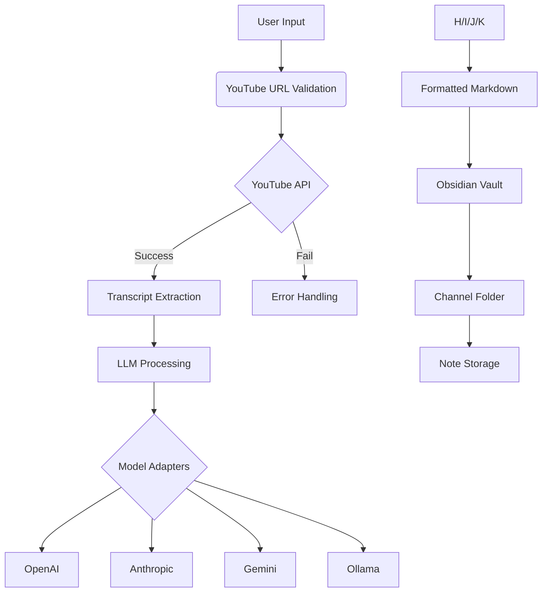

# PostNotes Architecture Specification

## System Architecture


## Component Responsibilities
1. **Input Controller**
   - YouTube URL validation (regex pattern matching)
   - API key management for YouTube Data API
   - Transcript extraction retry logic

2. **LLM Orchestrator**
   - Model adapter pattern implementation
   - System instruction templating
   - Response formatting standardization

3. **Obsidian Gateway**
   - Frontmatter schema enforcement
   - Vault path configuration
   - Folder creation/validation

4. **Configuration Manager**
   - Encrypted credential storage
   - UI settings persistence
   - Environment validation

## Frontmatter Schema
```yaml
---
video_id: "ABC123"
channel: "Channel Name"
processed_at: 2025-03-09T01:20:00+01:00
llm_model: "claude-3-opus-20240229"
system_instruction: "summary_enhanced.md"
tags: ["yt-processing", "AI-generated"]
---
```

## Error Handling Strategy
| Priority | Failure Type          | Mitigation Strategy               |
|----------|-----------------------|-----------------------------------|
| 1        | YouTube API failures  | Exponential backoff retry (3x)    |
| 2        | LLM rate limiting     | Circuit breaker pattern           |
| 3        | File system errors    | Pre-flight permission checks      |
| 4        | Invalid user inputs   | Regex validation + UI tooltips    |

## Implementation Roadmap
1. **Core Pipeline (4 weeks)**
   - YouTube integration
   - Basic LLM processing
   - Obsidian file output

2. **Multi-LLM Support (2 weeks)**
   - Adapter pattern implementation
   - Configuration UI for model selection

3. **Enhanced Error Handling (1 week)**
   - Retry mechanisms
   - User-facing error messages

4. **Security hardening (1 week)**
   - Keyring integration
   - Input sanitization

## Security Requirements
- API keys stored using system keyring
- Sandboxed processing environment
- Input validation for all user-provided paths